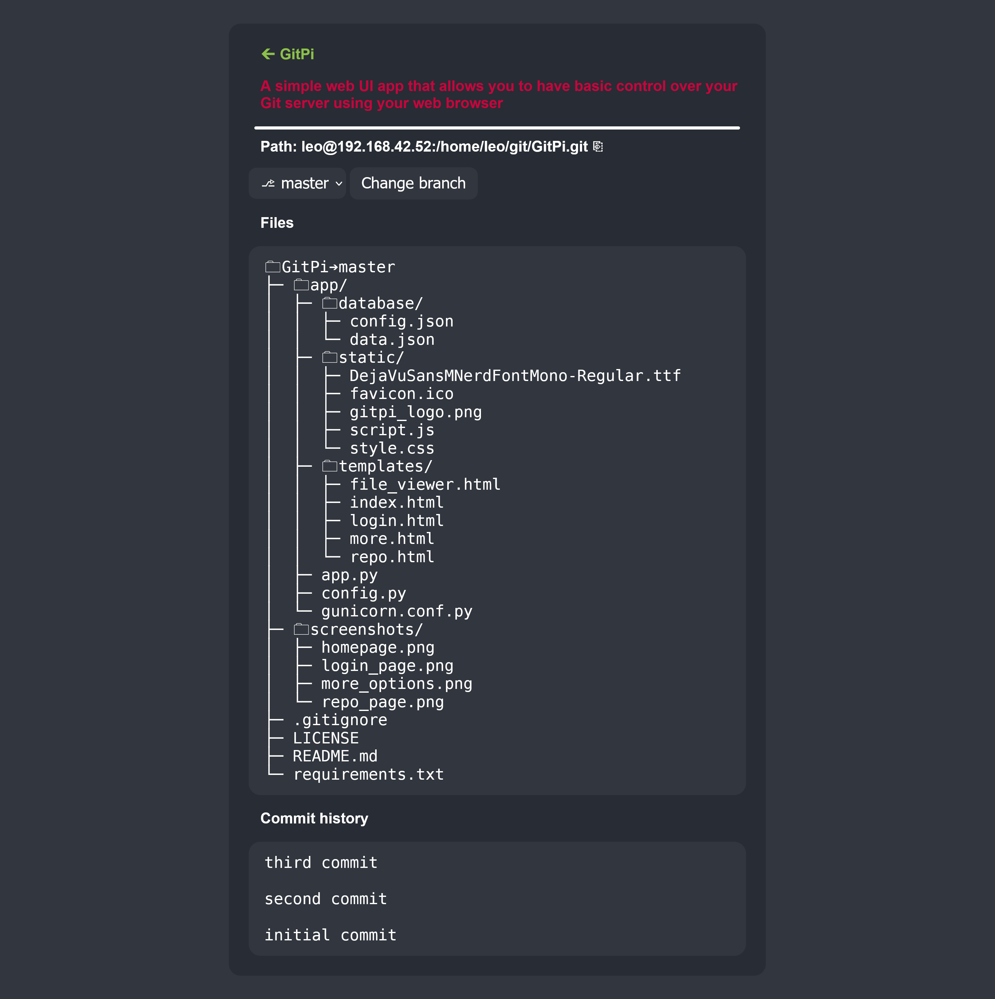
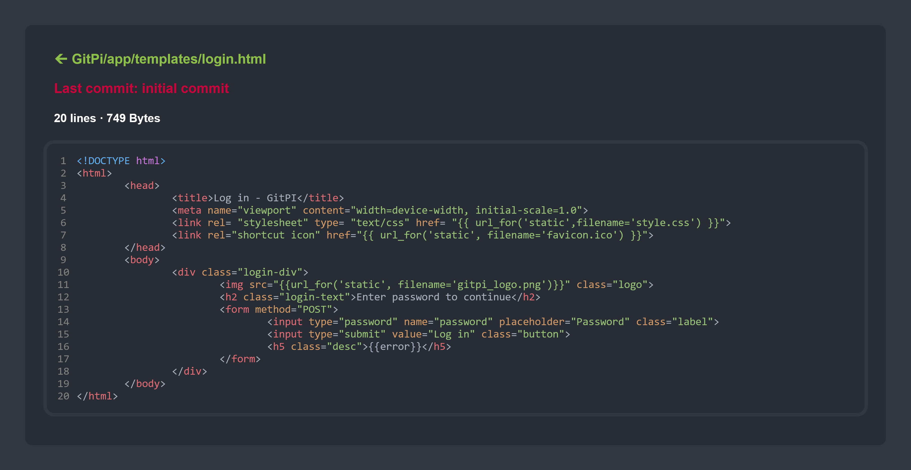
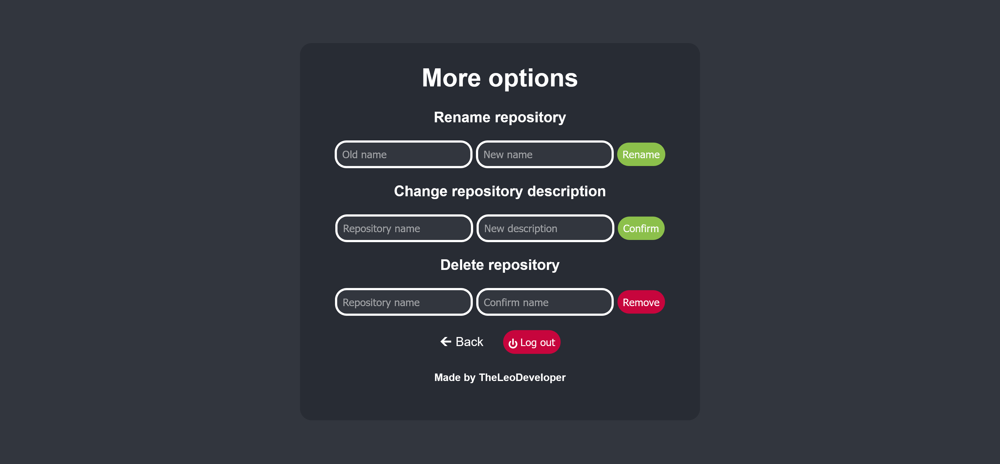

# GitPi
> A simple web UI app that allows you to have basic control over your Git server using your web browser.

## Table of Contents
* [General Info](#general-information)
* [Features](#features)
* [Screenshots](#screenshots)
* [Setup](#setup)
* [Usage](#usage)
* [Project Status](#project-status)
* [Credits](#credits)
* [Contact](#contact)

## General Information
A simple Git server web UI app written in python using Flask, it was intended to be used on a raspberry pi but it should work on pretty much any linux machine.

Allows you to have some basic control over your repositories inside your browser so you don't have to SSH into the server every time.

## Features

- Password protected
- Creating repositories 
- Renaming repositories 
- Deleting repositories 
- Displaying repository information
   - Name
   - Description
   - Path
   - List of branches
   - File structure
   - Commit history
- Viewing specific branch
- Viewing file information
   - File contents(read only) with syntax highlighting
   - File path
   - Last commit message for that specific file
   - Number of lines
   - Size

## Screenshots
Login page

Homepage

Repository info page

File viewer page

More options page

## Setup
Dependencies

Apt:
- Git
- Python 3

Pip:
- Flask 
- Bcrypt
- Gunicorn

### What you need before installing the app
You need to have a git server and know how to use it.

There are many guides like [this one](https://pimylifeup.com/raspberry-pi-git-server/) on how to setup a git server.

### 1. Install apt dependencies
First update apt packages list:

`$ sudo apt update`

Python 3 will likely come pre installed on your os but if you dont have it installed run:

`$ sudo apt install python3`

Next you will need to install git:

`$ sudo apt install git`

### 2. Cloning this git repository
First you need to clone this repository using git or download repository zip and unzip it.

`$ git clone https://github.com/leodev12345/GitPi`

### 3. Creating a virtual environment
This step is not necessary but it is recommended to run this app inside a virtual environment to prevent conflicting package versions between multiple apps, creating a python venv is simple, first change directory into the root of the repository and than create the venv:

`$ python3 -m venv venv`

If this command gives you an error you might need to install the venv module and than run the command again.

`$ sudo apt install python3-venv`

After a few seconds the venv should be created, next you will need to activate it by running:

`$ source venv/bin/activate`

Now you will enter the venv, you will notice `(venv)` inside your terminal.

>If you want to get out of venv just run `deactivate`

Now install all pip dependencies by running this command:

`$ pip install -r requirements.txt`

### 4. Configuring the app
When you installed all the dependencies change directory into the `app` directory:

`$ cd app`

Now run `config.py`:

`$ python3 config.py`

Select option 1 for first time setup and than configure everything to your liking.

### 5. Run the app
When you are inside the app directory run the app by using this command:

`$ gunicorn`

Now you can access the web UI by typing in `http://your_server_ip:5000` as your browser url bar.

## Usage
### Web UI
To create repositories you have to enter the name for the repo and click create, description is optional, the app will than init a bare git repository on your server in the storage location you specified in the setup.

You can view all the repositories you created on the homepage and copy their path with the copy button.

To view more repository info click on the repository name.

To change branch select a different branch from the dropdown menu and click change branch.

To view a specific file click on its name in the file tree and the link will redirect you to the file viewer.

If you want to rename, delete or change description of some repositories you can click the tree dots on the top navigation bar which will lead you to the more options page where you can also log out of the app.

Also note when you delete a repository it's only deleted from the app and not from the server, I did this for security reasons.

### Config program
You can use the terminal config program to view current configuration, to setup the app or to change certain options, you can also delete all repository data from the app if you ever need to re import your repositories for some reason.

If you already have git repositories inside your repository storage location you can import them into the app by selecting the option 3, the app will enter all of the repository data automaticly and you can only optionally add a repository description for each repository.
## Project Status
I made this project for fun and to use it for my own git server and its features are limited.

I would not recommend using this if your git server is open to the internet, I don't know how secure this app is but I'm guessing that it's not, but if you are just using it on your private home network than it's fine.

Also I'm not certain on how many devices can access the app at once since I intended it to only be used by me on my home network.

Overall this is a very simple app I just made for fun so if you are looking for more features or for more security than you should just use something like gitea or something similar.

If you want to add more feaures or to improve this project or to just use the code for your own project you can fork/clone this repository and edit the source code.

## Credits
I modified the Git logo that is created by [Jason Long](https://twitter.com/jasonlong) and licensed under the [Creative Commons Attribution 3.0 Unported License](https://creativecommons.org/licenses/by/3.0/) to create the icon for the app, it's downloaded from [https://git-scm.com/downloads/logos](https://git-scm.com/downloads/logos)

I included the DejaVuSansMono Nerd Font in the app which is licensed under the [SIL Open Font License, Version 1.1](https://scripts.sil.org/OFL) license and downloaded from [https://github.com/ryanoasis/nerd-fonts/tree/master/patched-fonts/DejaVuSansMono/Regular](https://github.com/ryanoasis/nerd-fonts/tree/master/patched-fonts/DejaVuSansMono/Regular)
## Contact
Email: [pycityproject@gmail.com](mailto:pycityproject@gmail.com)

Discord: [https://dsc.gg/leodev](https://dsc.gg/leogames)

