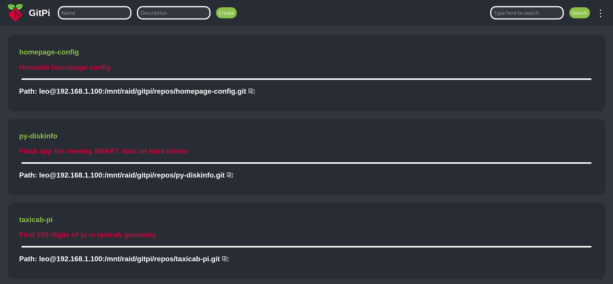

# GitPi
> A simple web UI app that allows you to have basic control over your Git server using your web browser.

## Table of Contents
* [General Info](#general-information)
* [Features](#features)
* [Screenshots](#screenshots)
* [Setup](#setup)
* [Usage](#usage)
* [Limitations](#limitations)
* [Credits](#credits)
* [Contact](#contact)


## General Information
A simple Git server web UI app written in python using Flask, it was intended to be used on a raspberry pi but it should work on pretty much any linux machine.

Allows you to have some basic control over your repositories inside your browser so you don't have to SSH into the server every time to manage your repositories.

Unlike some other solutions due to it's simplicity it uses very little resources, I have been using it for some time now on my main server and it seems to use about 30MB of RAM all the time.

## Features

- Password protected
- Creating repositories 
- Renaming repositories 
- Deleting repositories
- Searching repositories
- Displaying repository information
   - Name
   - Description
   - Path
   - List of branches
   - File structure
   - Commit history
- Viewing specific branch
- Viewing file information
   - File contents(read only) with syntax highlighting
   - File path
   - Last commit message for that specific file
   - Number of lines
   - Size

## Screenshots
Login page


Homepage


Repository info page


File viewer page


More options page


## Setup

> NOTE: If you plan to run this app on your server that is open to the internet I would highly advise against it, this app was made to run inside a private home network, for more info check out [limitations](#limitations).

Dependencies

apt:
- Git
- Python 3

pip:
- Flask 
- Bcrypt
- Gunicorn

### What you need before installing the app
You need to have a git server and know how to use it.

There are many guides like [this one](https://pimylifeup.com/raspberry-pi-git-server/) on how to setup a git server.

### Docker
> NOTE: The provided Docker image is built for amd64 and arm64 so it should run on most devices but armv6 and armv7 are not supported so Raspberry Pi 1 and original Raspberry Pi Zero are not supported, including early armv7 versions of the Raspberry Pi 2. I had some problems building for armv7 but it is probably possible to build a working image for it, on the other hand finding new base images supporting armv6 is very difficult now so I doubt Pi 1 and 0 will ever be supported, but those devices can still run the app normally [outside of docker](#1.-install-apt-dependencies).

You can install the app with the provided `compose.yaml` file using docker compose, but you will need to edit some of the contents for it to run on your setup, you will need to specify bind mount points for the apps database dir and the repos dir and you will need to configure the env variables like its specified in the file.

Example `compose.yaml` config:

```
services:
  GitPi:
    image: leodev12345/gitpi:latest 
    container_name: gitpi
    ports:
      - 5000:5000
    environment:
      PASSWORD: "password123"
      STORAGE_PATH: "/mnt/raid/gitpi/repos/"
      SERVER_USER: "leo"
      HOST_IP: "server.lan"
    volumes:
      - /mnt/raid/gitpi/database:/app/database
      - /mnt/raid/gitpi/repos:/app/repos
    restart: always
```

Example Docker CLI command:
```
docker run -d -p 5000:5000 \
  -e PASSWORD="password123" \
  -e STORAGE_PATH="/mnt/raid/gitpi/repos/" \
  -e SERVER_USER="leo" \
  -e HOST_IP="server.lan" \
  -v /mnt/raid/gitpi/database:/app/database \
  -v /mnt/raid/gitpi/repos:/app/repos \
  --name gitpi \
  leodev12345/gitpi:latest
```

Port - change it to the port you want to use to access the web UI, default is 5000 (make sure you edit the first number to the port you need and not the second number, the second number must always stay 5000!)

PASSWORD - set it to the password you will use to log in into the web UI

STORAGE_PATH - set it to the path to the dir where all your repositories will be located on the server, it should be the same as the path for the bind mount for the repos directory in the container

SERVER_USER - set this to the username of the linux user you will use to access the git repos over ssh, it will only be shown in the repo path in the web UI. You will use this user to access the git server over ssh when cloning repositories, pushing, etc.

HOST_IP - set this to the IP adress of the host server or to the servers domain, it will only be used to display the full path to the repo in the web UI.

`/app/database` - this is where all the app config will be stored, mount it to some folder on the host system, in this example its mounted to `/mnt/raid/gitpi/database`

`/app/repos` - this is where all the repos will be stored, here in this example `/mnt/raid/gitpi/repos` is mounted to the app repo dir

### Docker(in CasaOS)
First open the App Store and click "Custom install" in the top right corner than click on the little "import" icon in the top right corner, select Docker Compose and paste(or upload) your `compose.yaml` config and click "Submit".

You will have to manually type in the web ui port in the "Web UI" section, type in the one port which is exposed (in the example above it was 5000).

And lastly if you want you can set an icon by pasting the following icon url inside the "Icon URL" box:
```
https://raw.githubusercontent.com/leodev12345/GitPi/main/app/static/gitpi_logo.png
```

### Setup without Docker
### 1. Install apt dependencies
First update apt packages list:

`$ sudo apt update`

Python 3 will likely come pre installed on your os but if you dont have it installed run:

`$ sudo apt install python3`

Next you will need to install git:

`$ sudo apt install git`

### 2. Cloning this git repository
First you need to clone this repository using git or download repository zip and unzip it.

`$ git clone https://github.com/leodev12345/GitPi`

### 3. Creating a virtual environment
This step is not necessary but it is recommended to run this app inside a virtual environment to prevent conflicting package versions between multiple apps, creating a python venv is simple, first change directory into the root of the repository and than create the venv:

`$ python3 -m venv venv`

If this command gives you an error you might need to install the venv module and than run the command again.

`$ sudo apt install python3-venv`

After a few seconds the venv should be created, next you will need to activate it by running:

`$ source venv/bin/activate`


Now you will enter the venv, you will notice `(venv)` inside your terminal.

>If you want to get out of venv just run `deactivate`

Now install all pip dependencies by running this command:

`$ pip install -r requirements.txt`

### 4. Configuring the app
When you installed all the dependencies change directory into the `app` directory:

`$ cd app`

Now run `config.py`:

`$ python3 config.py`

This is the main screen of the config program:

```
Configuration options:

[1] First time setup
[2] Change configuration
[3] Import local repositories into the app
[4] Display current configuration
[5] Exit

Chose an option:
```

Select option 1 for first time setup and than configure everything to your liking.

For example:

```
Create password: password
Password set to password
Set storage location for your repositories: /home/leo/git
Storage path set to: /home/leo/git/
Server IP adress: 192.168.42.52
Set server user(leave blank for current linux user): git
Server user: git
Setup complete!

Press ENTER to continue
```

The password you create is used to login into the web UI. The storage location is the place where all of your reposiotries will be stored. The program will also output the servers IP adress that you can use to access the web UI. The server user is the linux user that you will use to interact with the repositories over SSH, it is included in the repository path on the web UI, you can create a new user and select it or you can just use the user that you are currently logged into.

### 5. Run the app
When you are inside the app directory run the app by using this command:

`$ gunicorn`

Now you can access the web UI by typing in `http://your_server_ip:5000` as your browser url bar.

### 6. Run as service (optional)
If you want gitpi to automaticly start on boot and always run you should set it up as a service, in the repository root a `gitpi.service` file is provided and with a few tweaks it should easily be set up.

Example `gitpi.service` config:
```
[Unit]
Description=Gunicorn instance to serve GitPi
After=network.target

[Service]
# Set to your user and user group
User=leo
Group=leo

# Define the GitPi program path
Environment="GITPI_DIR=/home/leo/programs/gitpi" 

WorkingDirectory=${GITPI_DIR}/app
Environment="PATH=/usr/local/sbin:/usr/local/bin:/usr/sbin:/usr/bin:/sbin:/bin:${GITPI_DIR}/venv/bin"
ExecStart=${GITPI_DIR}/venv/bin/gunicorn

[Install]
WantedBy=multi-user.target
```

User - set it to the user the program should be run as, in this example its set to user leo, if you want to run it as root you can just delete User and Group

Group - set it to your user group of the user you specified, its probably the same as your username

Lastly set GITPI_DIR env variable to the full path to the directory where the gitpi app is stored(where you cloned this repository), in this example path is `/home/leo/programs/gitpi`

Edit the file and save it, than copy the file to `/etc/systemd/system`:
```
$ sudo cp /path/to/GitPi/gitpi.service /etc/systemd/system/
```

Now reload systemd:
```
$ sudo systemctl daemon-reload
```

Enable the service to run it on startup:
```
$ sudo systemctl enable gitpi
```

And lastly start the service:
```
$ sudo systemctl start gitpi
```

You can check the status of the service for errors if you want to:
```
$ sudo systemctl status gitpi
```
## Usage
### Web UI
To create repositories you have to enter the name for the repo and click create, description is optional, the app will than init a bare git repository on your server in the storage location you specified in the setup.

You can search repositories using the search bar, clicking search with the empty bar will take you back to the main page

You can view all the repositories you created on the homepage and copy their path with the copy button.

To view more repository info click on the repository name.

To change branch select a different branch from the dropdown menu and click change branch.

To view a specific file click on its name in the file tree and the link will redirect you to the file viewer.

If you want to rename, delete or change description of some repositories you can click the tree dots on the top navigation bar which will lead you to the more options page where you can also log out of the app.

Also note when you delete a repository it's only deleted from the app and not from the server, I did this for security reasons.

### Config program
You can use the terminal config program to view current configuration, to setup the app or to change certain options, you can also delete all repository data from the app if you ever need to re import your repositories for some reason.

If you already have git repositories inside your repository storage location you can import them into the app by selecting the option 3, the app will enter all of the repository data automaticly and you can only optionally add a repository description for each repository.
## Limitations
I made this project for fun and to use it for my own git server and its features are limited.

I would not recommend using this if your git server is open to the internet, I don't know how secure this app is but I'm guessing that it's not, but if you are just using it on your private home network than it's fine.

Also I'm not certain on how many devices can access the app at once since I intended it to only be used by me on my home network.

Overall this is a very simple app I just made for fun so if you are looking for more features or for more security than you should just use something like gitea or something similar.

If you want to add more feaures or to improve this project or to just use the code for your own project you can fork/clone this repository and edit the source code.


## Credits
I modified the Git logo that is created by [Jason Long](https://twitter.com/jasonlong) and licensed under the [Creative Commons Attribution 3.0 Unported License](https://creativecommons.org/licenses/by/3.0/) to create the icon for the app, it's downloaded from [https://git-scm.com/downloads/logos](https://git-scm.com/downloads/logos)

I included the DejaVuSansMono Nerd Font in the app which is licensed under the [SIL Open Font License, Version 1.1](https://scripts.sil.org/OFL) license and downloaded from [https://github.com/ryanoasis/nerd-fonts/tree/master/patched-fonts/DejaVuSansMono/Regular](https://github.com/ryanoasis/nerd-fonts/tree/master/patched-fonts/DejaVuSansMono/Regular)
## Contact
Email: [pycityproject@gmail.com](mailto:pycityproject@gmail.com)

Discord: [https://dsc.gg/leodev](https://dsc.gg/leogames)

