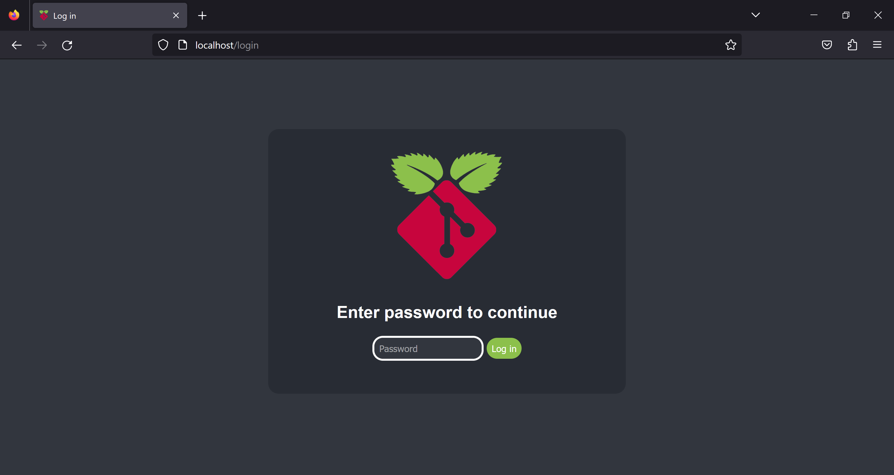
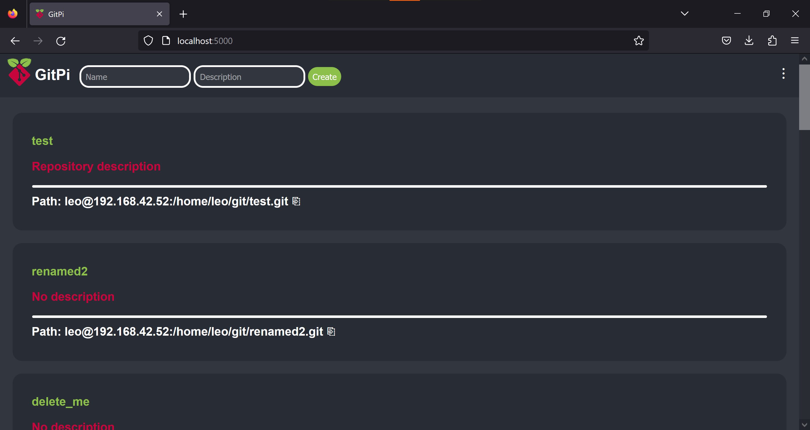
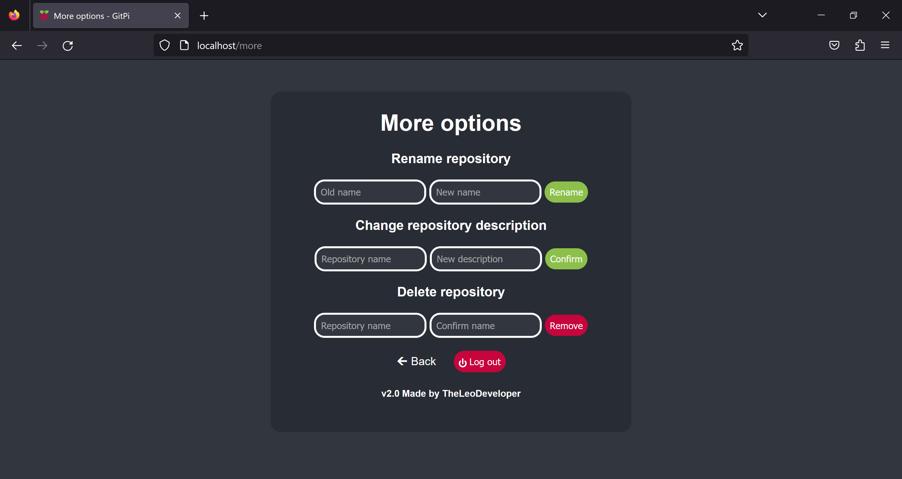

# GitPi
> A simple web UI that allows basic controls over your git server.

## Table of Contents
* [General Info](#general-information)
* [Features](#features)
* [Screenshots](#screenshots)
* [Setup](#setup)
* [Usage](#usage)
* [Project Status](#project-status)
* [Credits](#credits)
* [Contact](#contact)

## General Information
A simple git server web app written in python using Flask, it was intended to be used on a raspberry pi but it should work on pretty much any linux machine.

Allows you to have some basic controls over your repositories inside your browser so you don't have to SSH into the server every time.

## Features

- Login page
- Creating repositories 
- Renaming repositories 
- Deleting repositories 
- Display basic repository info
   - Name 
   - Description
   - Full path that you can copy to clipboard

## Screenshots

Login page

Homepage

More options page
## Setup
Dependencies
- Git
- Python 3 (I used 3.8 and 3.9)
- Flask 
- Bcrypt

To install these run:

`$ sudo apt update`

`$ sudo apt install git`

`$ sudo apt install python3`

`$ pip3 install flask`

`$ pip3 install bcrypt`

If you dont have pip3 installed run:

`$ sudo apt install python3-pip`

Also if you havent already you should setup a DHCP reservation so that your servers IP adress doesent change.

After installing dependencies clone this repository with git, or you can just download it and unzip it.

`$ git clone https://github:com/leodev12345/gitpi`

After cloning the repository run the `setup.py` located in the app folder:

`$ python3 setup.py`

The setup will ask you to create a password you will use to login into the web ui and will ask you to enter the folder path where your repositories will be stored.

After configuring the app it will print out the servers IP adress that will be used to access the web ui.

The username the program prints out is the linux user which will be used to run the server, its just setup as the current user so if you want it to be a different user you will have to login into that user and than run the setup.

### Running with a WSGI server(recommended)

You can run the app with gunicorn or a similar tool, if you dont have gunicorn installed run this command:

`$ pip3 install gunicorn`

After you install it it's really easy to run the app, just go into the app folder and run this command:

`$ gunicorn --bind 0.0.0.0:5000 wsgi:app`

Note that this will run the app on port 5000, so when you type the IP adress of the server into your browser you will need to add `:5000` at the end, for example `http://192.168.1.100:5000`.

If you want to run it on port 80 so you dont have to add the port to the adress you can follow [this guide](https://gist.github.com/justinmklam/f13bb53be9bb15ec182b4877c9e9958d) and than use authbind which will give normal user access to port 80, you can than run the app just like this:

`$ authbind --deep gunicorn --bind 0.0.0.0:80 wsgi:app`

And the app will now use the default http port 80 and you can access it without having to specify the port and you can easily access the interface by typing in the IP adress of the server into the browser.

### Running with flask development server

You can run the app by just running the `app.py` with python but I would only recommend using the built in development server for testing and debugging since its less advanced and less efficient than a WSGI server like gunicorn and can only handle one request at once, so with that said you can run the app by running:

`$ python3 app.py`

Note that you will most likely run into issues with permissions, so you can either change the port from 80 to something like 5000 in the last line of code in `app.py` and than access the app by typing in the IP adress and specified port into your browser, or you can follow the guide I mentioned above and than run it with authbind:

`$ authbind --deep python3 app.py`

Now you can just go into your browser and type in the IP adress of the server without specifying a port.
## Usage
To create repositories you have to enter the name for the repo and click create, description is optional, the app will than init a bare git repository in the storage location you specified in the setup.

You can view all the repositories you created on the homepage and copy their path with the copy button.

If you want to rename, delete or change description of some repositories you can click the tree dots on the top navigation bar which will lead you to the more options page where you can also log out of the app.

If you want to reset the configuration just edit the `config.json` in the `database` folder, than delete everything and replace it with`[]`, after that you can run the `setup.py` again to set up new config, currently there is no way to apply new configuration to already existing repositories so you will have to manually edit the `data.json` where repository info is stored.

Currently there is no way to import already existing repositories on the server into the app so you will have to also enter them manually into `data.json`.

Also note when you delete a repository it's only deleted from the app and not from the device, I did this for security reasons just in case.
## Project Status
I made this project for fun and it's features are very limited, I might add more features later, but probably not because I made this project to have some basic things i needed for my server.

I would also not recommend using this if your server is open to the internet, I don't know how secure this app is but I'm guessing that it's not, but if you are just using it on your private home network than it's fine.

Also im not certain on how many devices can access the server at once since I intended it to only be used by me on my home network.

Overall this is a very simple app i just made for fun so if you are looking for more features or for more security than you should just use something like gitea or something similar.

If you want to add more feaures or to improve this project or to just use the code for your own project you can fork/clone this repository and do whatever you want with it.

## Credits
I modified the Git logo that is created by [Jason Long](https://twitter.com/jasonlong) and licensed under the [Creative Commons Attribution 3.0 Unported License](https://creativecommons.org/licenses/by/3.0/) to create the icon for the app, it's downloaded from [https://git-scm.com/downloads/logos](https://git-scm.com/downloads/logos) 

Everyting else is coded and made by me. 
## Contact
Email: [pycityproject@gmail.com](mailto:pycityproject@gmail.com)

Discord: [https://dsc.gg/leogames](https://dsc.gg/leogames)

